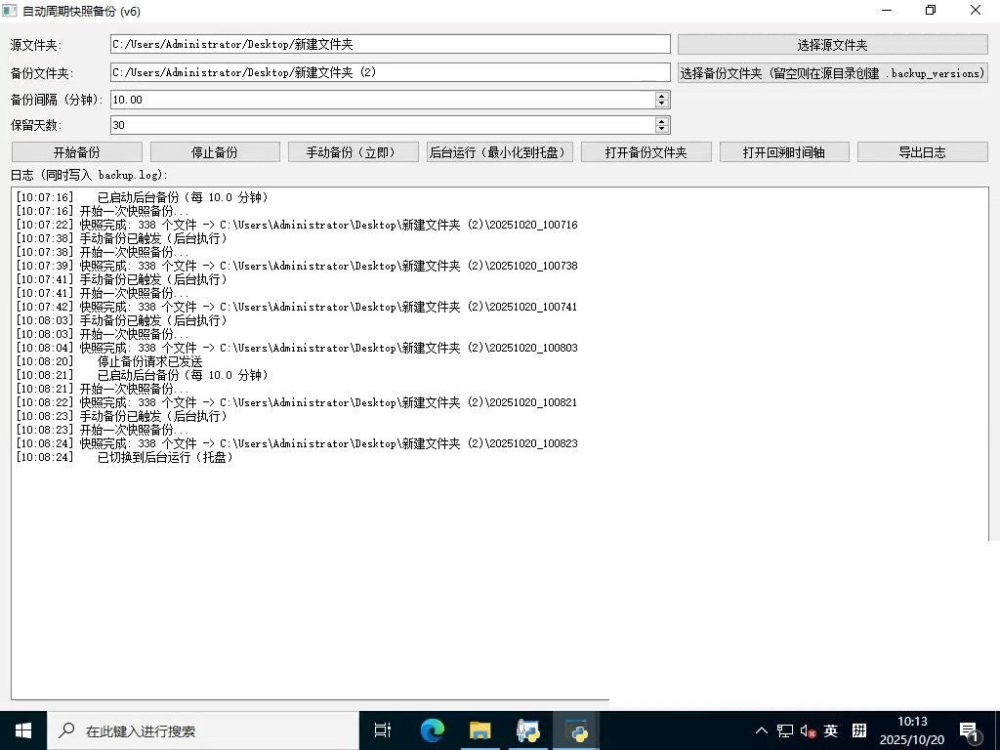
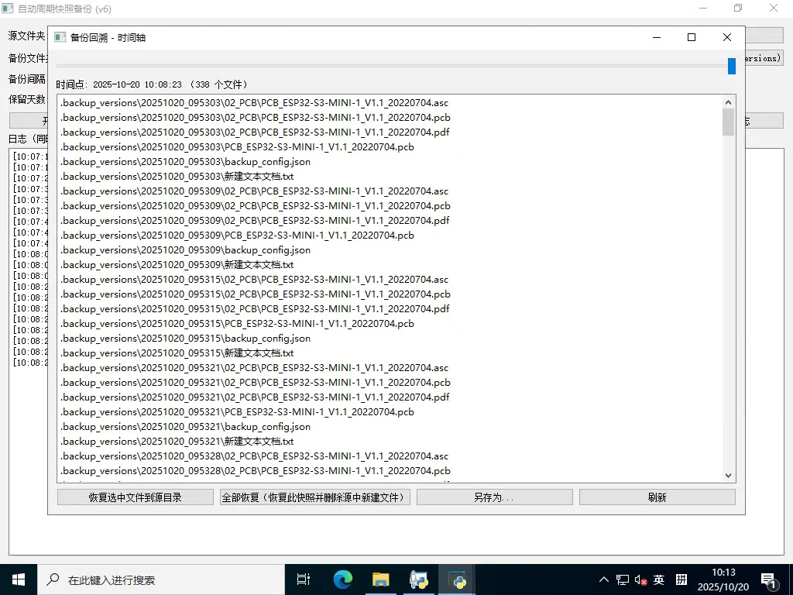

# 🧠 AutoBackup — 自动周期快照备份工具（Windows）

> **支持自动定时快照、隐藏备份目录、时间轴回溯、多进程安全与即时设置变更。**

---
## 🖼️ 界面预览





## 🚀 功能简介

AutoBackup 是一个基于 **Python + PyQt5 + pywin32** 的桌面备份工具，  
可对指定文件夹进行周期性快照式备份。

### ✅ 主要特性

- **自动备份**：可设置任意分钟间隔（支持小数，如 0.5 分钟=30秒）  
- **手动备份**：点击「立即备份」随时触发一次快照  
- **备份隐藏**：默认在源目录下创建隐藏文件夹 `.backup_versions`  
- **文件占用处理**：即使文件被占用，也会弹窗提示并跳过  
- **时间轴回溯**：可查看并恢复任意时间点的快照  
- **完整恢复模式**：恢复整个目录状态（包括删除新增文件）  
- **多实例防护**：同一目录下只允许一个实例运行  
- **动态修改设置**：运行中可随时更改间隔/保留天数并即时生效  
- **托盘后台运行**：启动后可最小化到托盘静默运行  
- **自动清理旧备份**：自动删除超过指定天数的快照  

---

## 🖥️ 使用方法

### 1️⃣ 安装依赖

```bash
pip install PyQt5 pywin32
